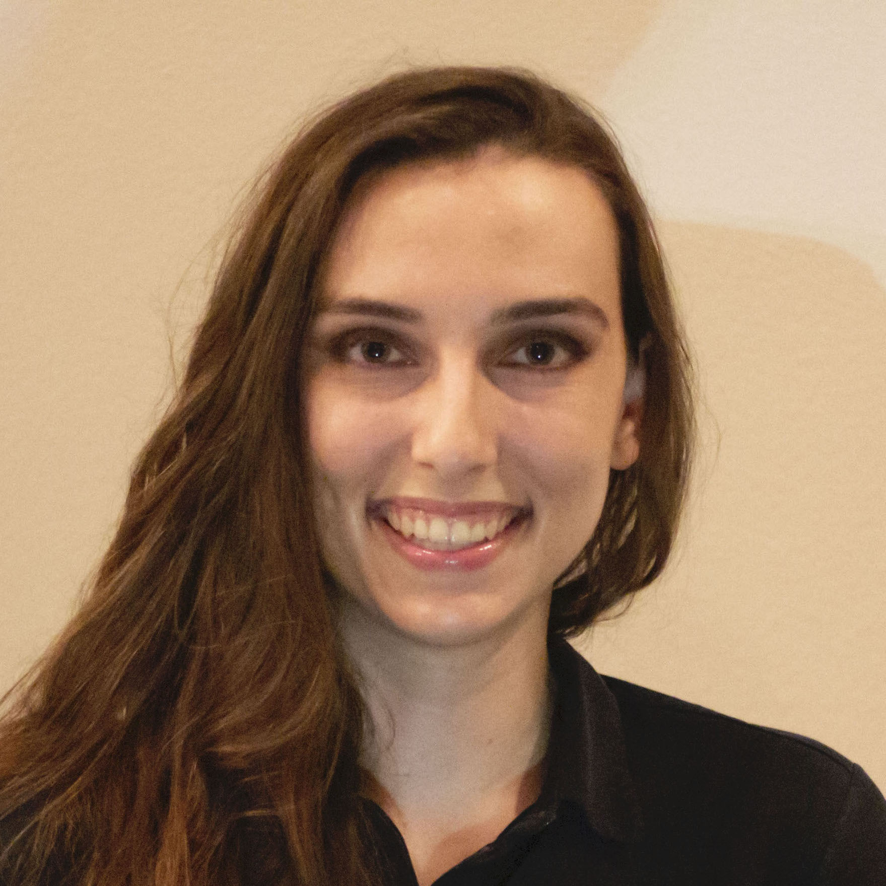

```{r setup, include=FALSE}
knitr::opts_chunk$set(echo = TRUE)
```
<br>
<br>

:::: {.columns}
::: {.column width="30%"}



<p class="text-muted">PhD Student</p>
[Haselton Lab](http://martiehaselton.com)

:::
::: {.column width="60%"}
I’m a fourth-year PhD student working in the Psychology Department at UCLA under the advisement of Dr. Martie Haselton. My focus is on the relationship between psychology, hormones, and behavior, particularly for women and sexual minorities. For more information about my research interests, check my Projects page.
<br>
<br>
<br>
<a href="pub_cv.html" class="btn btn-primary">Publications & CV</a>
<a href="projects.html" class="btn btn-primary">Projects</a>
:::
::::


